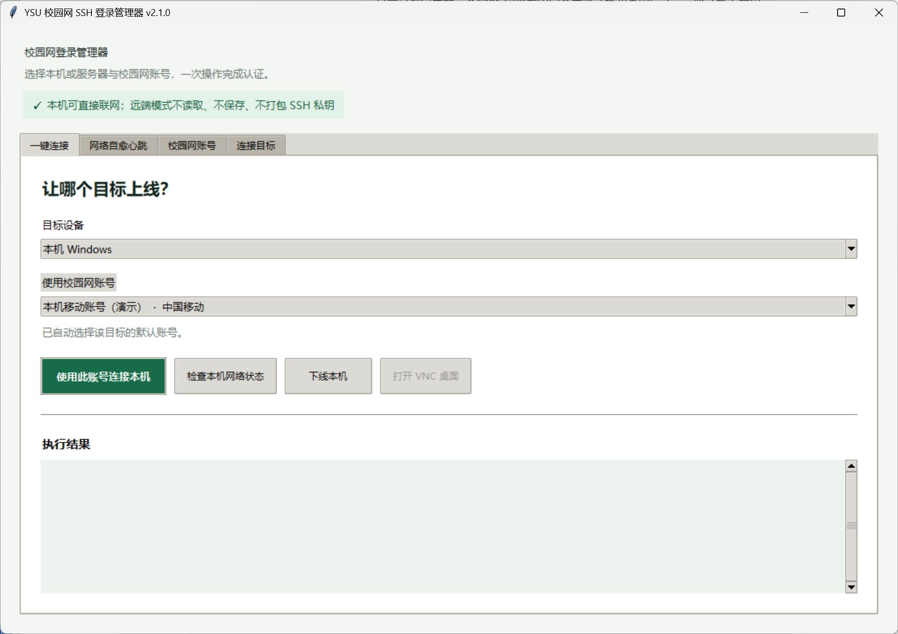
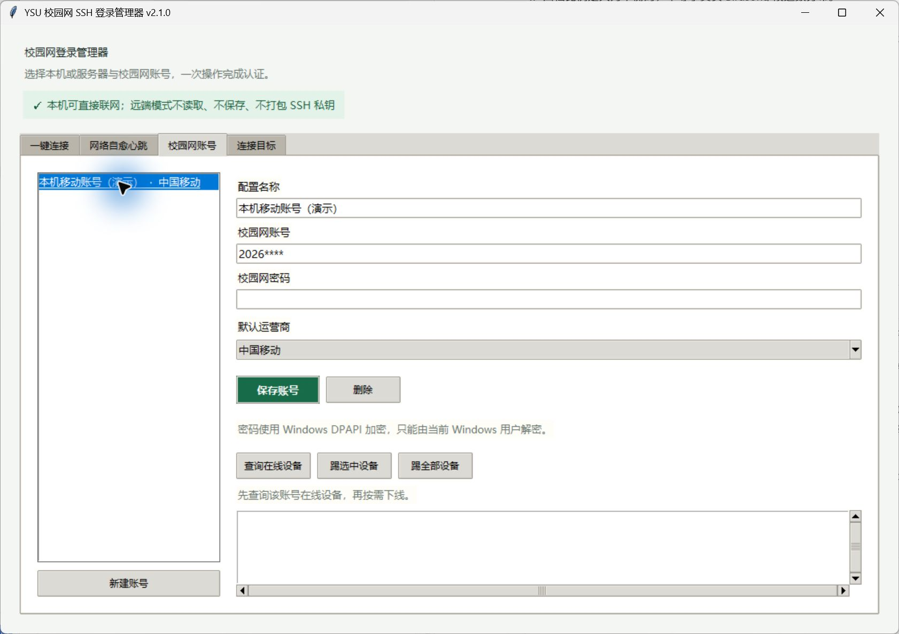
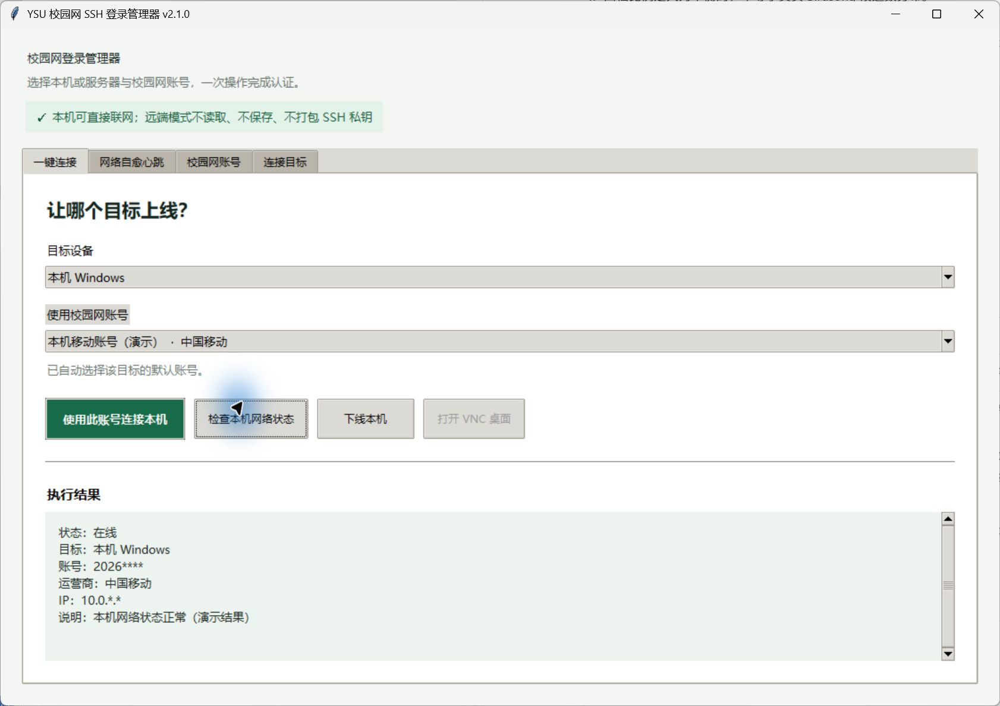
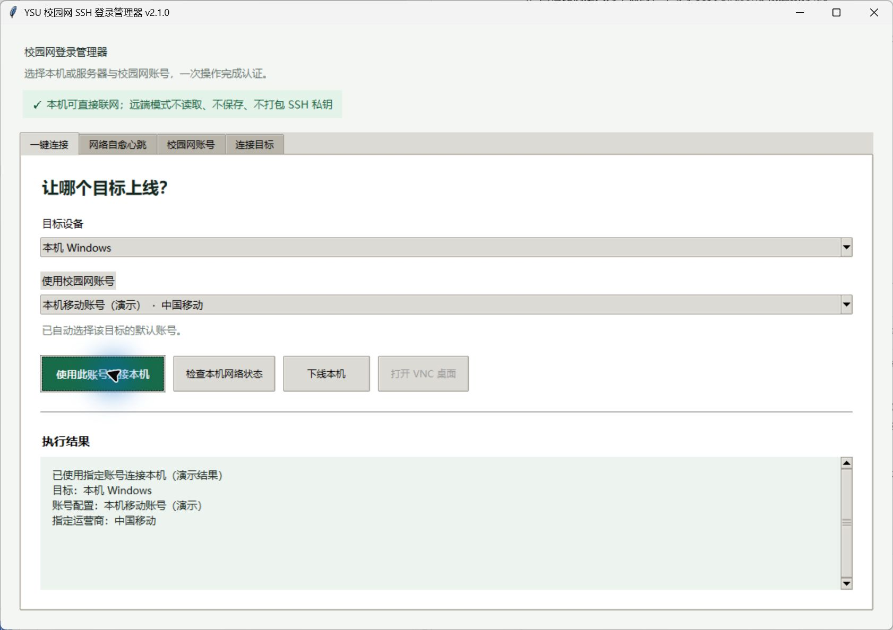
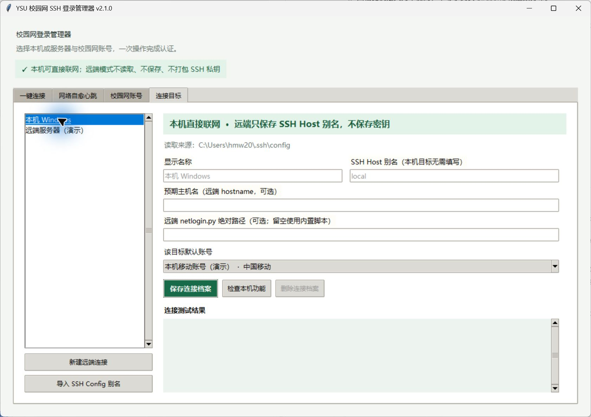
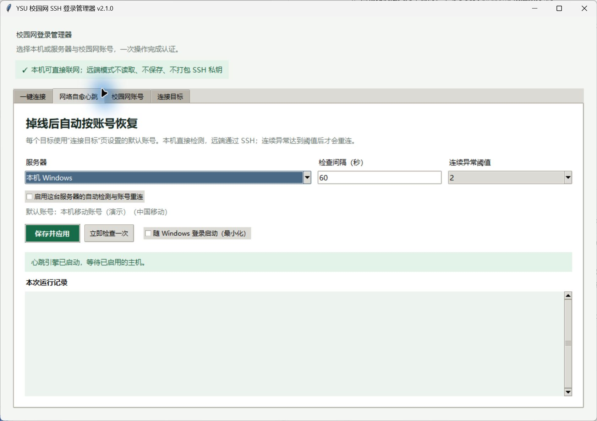
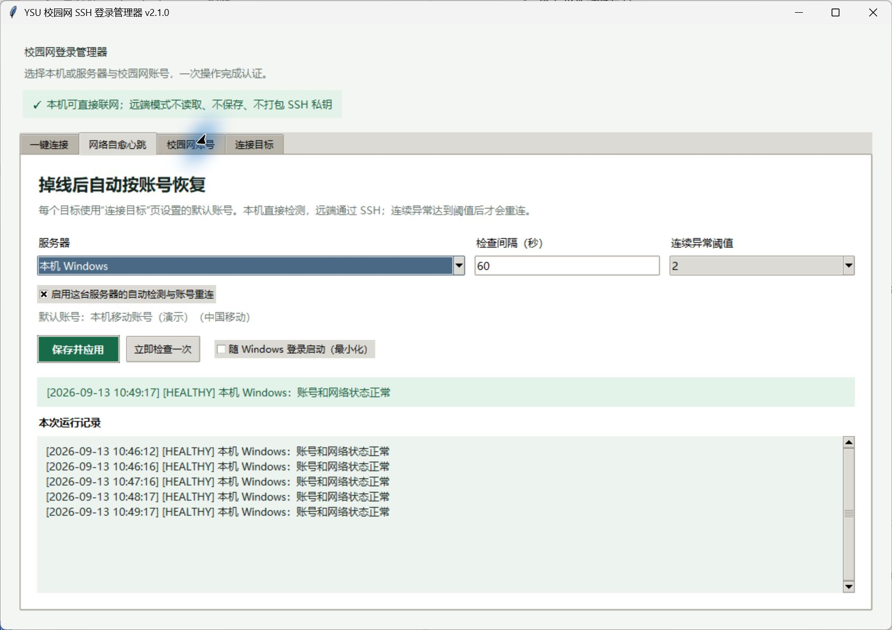

# YSU Netlogin 自愈版：Windows 本机使用与配置

适用版本：`2.1.3`；适用系统：Windows 10/11 x64。

## 1. 下载与启动

1. 在 GitHub 仓库的 Releases 页面下载 `ysu-netlogin-healing-2.1.3-windows-x64.zip`。
2. 将压缩包完整解压到一个长期不移动的目录，例如 `D:\Tools\YSU-Netlogin`。
3. 双击 `YSU-Netlogin-Healing-Manager.exe`。
4. Windows SmartScreen 首次提示时，先核对发布页 SHA256，再选择“更多信息 → 仍要运行”。本程序目前没有商业代码签名证书。

程序无需另外安装 Python。账号配置保存在 `%APPDATA%\YSUNetloginManager\config.json`，账号密码由 Windows DPAPI 加密，只有保存它的当前 Windows 用户能够解密。



## 2. 添加校园网账号

1. 打开“校园网账号”页，点击“新建账号”。
2. 填写容易识别的配置名称、校园网账号、密码和要使用的运营商。
3. 点击“保存账号”。

可保存多个账号。密码由 Windows DPAPI 加密，不会出现在心跳日志或远端命令行中。

保存后可在本页点击“查询在线设备”。如果该账号正在本机使用，程序会自动复用当前认证会话，
不会再次提交 CAS 登录。查询结果只包含学校 `findDevice` 接口实际返回、且属于当前所选账号的
会话；使用其他账号配置登录的服务器或电脑不会合并显示，需要切换到对应账号分别查询。



## 3. 检查本机网络并使用指定账号连接

1. 打开“一键连接”页，在“目标设备”中选择“本机 Windows”。
2. 点击“检查本机网络状态”。结果区会显示当前是否在线、认证账号、运营商和本机校园网 IP。
3. 在“使用校园网账号”中选择第 2 节保存的账号；账号配置中的运营商就是本次连接使用的运营商。
4. 点击“使用此账号连接本机”。

如果本机已经使用同一账号和运营商在线，程序不会重复认证。如果检测到当前账号或运营商不一致，程序会先下线旧会话，再使用指定配置重新连接。外网可达但校园网门户暂时无法识别账号时，程序会保持当前网络，避免误踢健康连接。





本机操作不需要 OpenSSH、远端 Python 或服务器。只有管理远端服务器时才需要下面的 SSH 配置。

### 指定在线设备查询位置

“查询在线设备”读取的是执行位置所在机器的 auth1 校园网会话。若账号已经在
4090 上线，而本机使用另一个账号，应在“校园网账号”页把“在线设备查询位置”
选择为 4090。2.1.3 会优先把已有的 `c201-4090` 连接设为默认位置，也可以随时
改回本机或其他服务器。

点击查询位置右侧的“检查资格”，可以先确认这台机器是否具备校园网查询条件。查询、
设备下线以及让目标机器登录运营商之前，程序也会自动执行相同预检。若目标机器不能访问
学校认证环境或无法取得 auth1 `sessionId`，程序会停止后续操作并提示需要先实现访问校园局域网。

查询位置必须能够访问学校认证网络；所选账号与该位置当前在线账号一致时，程序
会复用当前会话，不重复登录。跨账号查询仍可能需要认证服务器接受保存的账号密码。

## 4. 准备远端 SSH 连接（可选）

自愈程序在本机运行，通过 Windows OpenSSH 管理远端 Linux 服务器。先在 PowerShell 验证目标别名能够免交互登录：

```powershell
ssh 你的SSH别名 hostname
```

如果 Windows 没有 `ssh`，请在“设置 → 系统 → 可选功能”中安装“OpenSSH 客户端”。建议在 `%USERPROFILE%\.ssh\config` 中配置 Host 别名，并使用 `ssh-agent` 或现有密钥完成认证。程序不会读取、复制或打包 SSH 私钥，也不会关闭主机密钥校验。

## 5. 绑定目标与默认账号

1. 打开“连接目标”页。“本机 Windows”是内置目标，不能删除。
2. 选择“本机 Windows”，为它设置默认账号并保存；如果还要管理远端服务器，再点击“导入 SSH Config 别名”。
3. 对远端连接档案填写显示名称和 SSH Host 别名。
4. “预期主机名”建议填写远端 `hostname` 的精确结果，用来防止连错服务器。
5. 远端 `netlogin.py` 路径可以留空；留空时使用 EXE 内置脚本，临时投递并在运行后删除。
6. 在“该目标默认账号”中选择账号并保存。远端目标可点击“测试 SSH”，本机目标可点击“检查本机功能”。



## 6. 启用网络自愈心跳

1. 打开“网络自愈心跳”页，选择“本机 Windows”或远端服务器。
2. 建议将检查间隔设为 `60` 秒、连续异常阈值设为 `2`。
3. 勾选“启用这台服务器的自动检测与账号重连”，点击“保存并应用”。
4. 点击“立即检查一次”，确认运行记录显示账号和网络状态正常。
5. 如需无人值守运行，勾选“随 Windows 登录启动（最小化）”。请不要再移动 EXE；若移动过，取消后重新勾选一次。





心跳的处理规则如下：

- 账号、运营商和联网状态都正常：只记录健康状态，不做修改。
- 外网可达但认证门户暂时无法识别账号：保持现状，避免误踢健康连接。
- 连续异常未达到阈值：只告警，不重连。
- 确认离线：使用该主机绑定的默认账号重连，再做一次状态验证。
- 当前账号或运营商不符合绑定配置：先下线旧会话，再按默认账号重连。
- SSH 或认证持续失败：按指数退避重试，最长等待 15 分钟，防止请求风暴。

关闭程序会停止本机心跳。手动点击“下线当前服务器”时，如果该主机仍启用了心跳，稍后会被自动重新连接；需要保持离线时，请先在心跳页停用该主机。

## 7. 验证与日志

心跳页会显示本次运行的完整记录。每次进程还会使用独立日志文件：

```text
%LOCALAPPDATA%\YSUNetloginManager\logs\heartbeat-时间-PID.log
```

日志创建失败不会阻止检测或重连。日志不记录密码、SSH 私钥或登录数据。

下载后可在 PowerShell 校验 EXE：

```powershell
Get-FileHash -Algorithm SHA256 .\YSU-Netlogin-Healing-Manager.exe
Get-Content .\SHA256SUMS.txt
```

## 8. 常见问题

以上截图使用脱敏演示账号和掩码 IP，仅用于说明操作位置；程序不会把真实账号、密码或 IP 写入教程截图。

- **提示找不到 SSH**：安装 Windows OpenSSH 客户端后重启程序。
- **只使用本机联网**：不需要安装 SSH；在“一键连接”页选择“本机 Windows”即可。
- **SSH 身份认证失败**：先让 `ssh 你的SSH别名 hostname` 在 PowerShell 中成功；程序不管理私钥。
- **主机名不匹配**：核对服务器身份，再修改连接档案中的预期主机名。
- **一直显示外网可达、账号未知**：这是保守保护状态，不会强制切线；可用“一键连接”页手动查询或登录。
- **想临时下线**：先停用对应主机的心跳，再执行下线。
- **更换 Windows 用户后密码无法读取**：这是 DPAPI 的预期保护，请在新用户下重新保存账号。
- **查询在线设备显示 HTTP 401**：先检查保存密码；如果本机正用该账号在线，新版会自动复用当前认证会话。列表为空或只有当前设备时，表示学校接口没有返回其他会话，并非程序隐藏设备。
